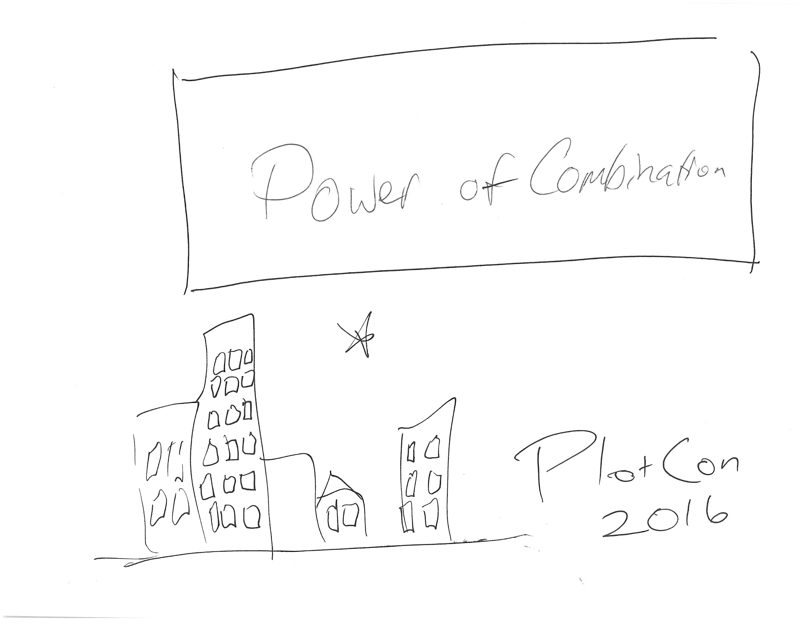
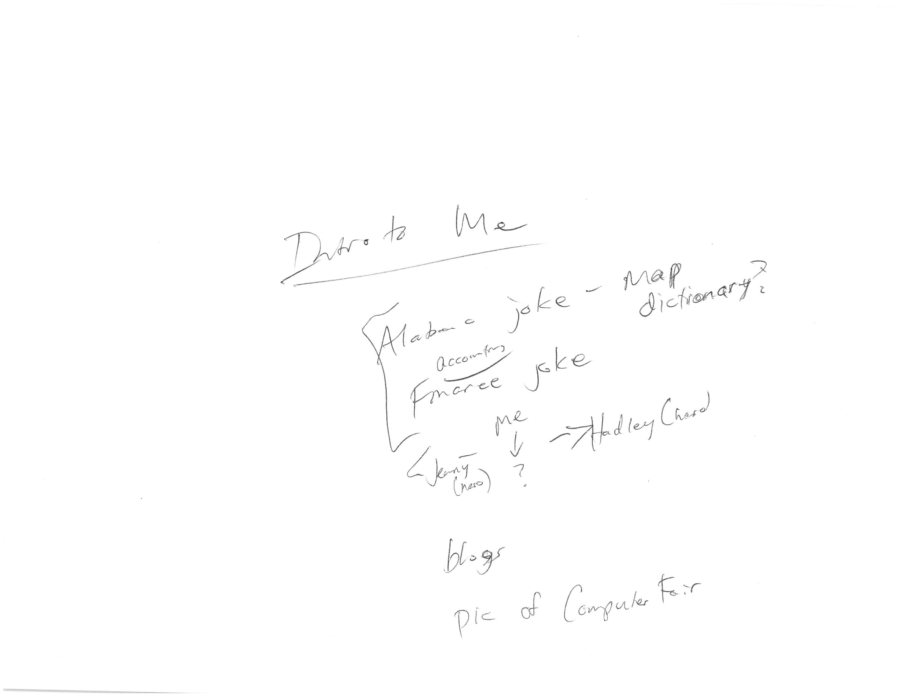
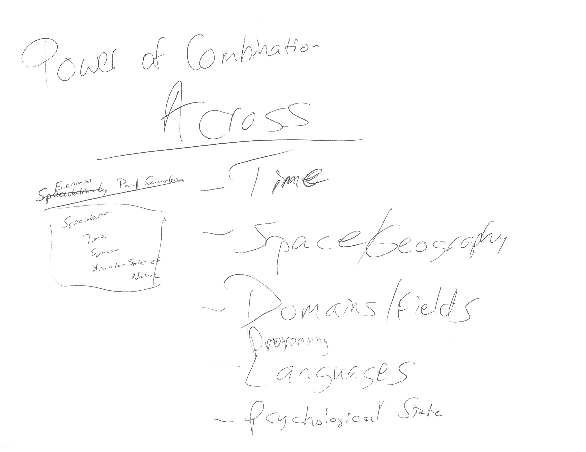
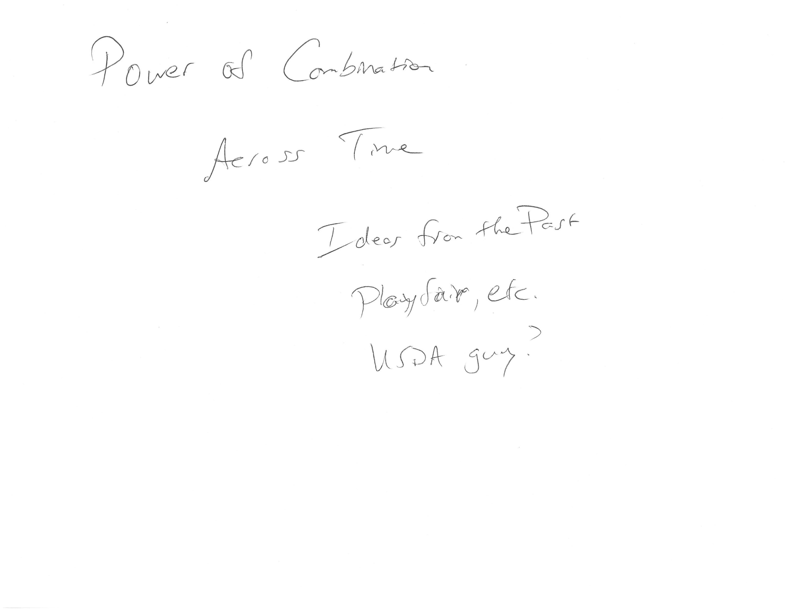
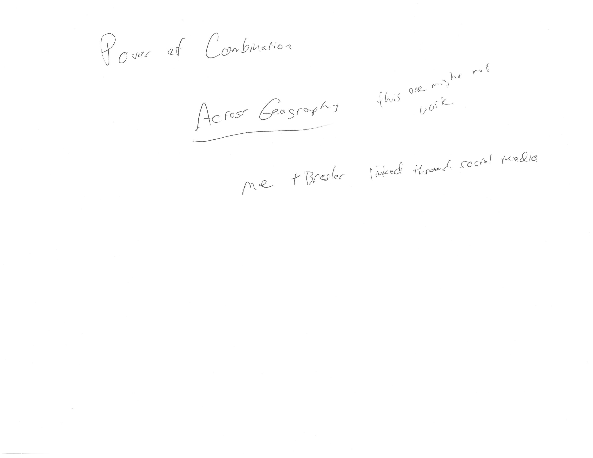
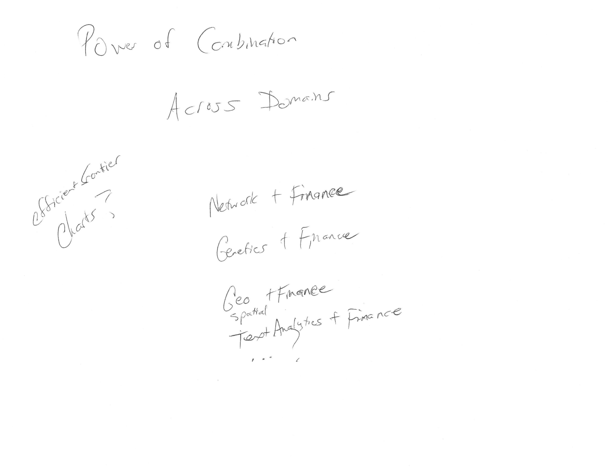
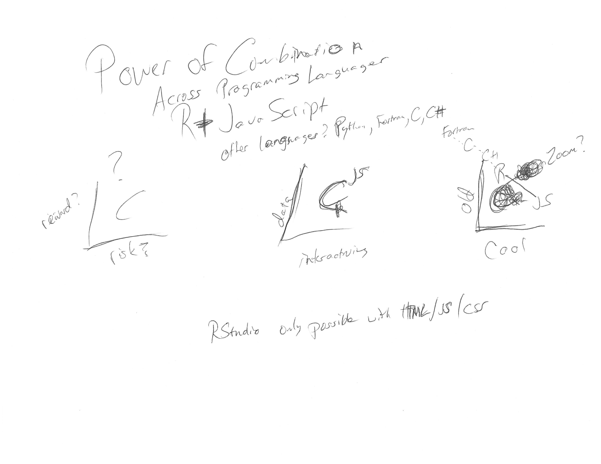

Power of Combination | PlotCon 2016
================

I am so excited, delighted, and honored to be speaking at [PlotCon 2016](https://plotcon.plot.ly/). This repo will serve as my open space for preparation, and as with all my repos, I welcome feedback, contributions, advice. I am scheduled between Jenny Bryan and Hadley Wickham, so I need to really bring it.

Ugly First Draft of Slides
--------------------------

I like to start ugly.

\[1\] </img> </img> </img> </img> </img> </img> </img> </img> </img>
